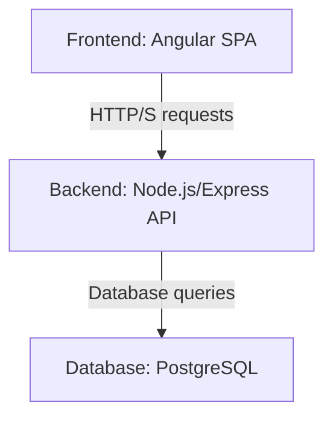

# System Architecture

The QUANT accounting system is designed as a classic client-server application, with a clear separation between the frontend (client) and the backend (server).

## High-Level Overview

### Frontend

The frontend is a single-page application (SPA) built with Angular. Its main responsibilities are:

*   **User Interface:** Rendering the application's UI and providing a responsive and interactive user experience.
*   **User Input:** Capturing user input through forms and other UI elements.
*   **API Interaction:** Communicating with the backend API to fetch and submit data.
*   **Client-Side State Management:** Managing the application's state on the client side.

The frontend is organized by features (e.g., authentication, financial statements, etc.), with each feature having its own set of components, services, and routes.

### Backend

The backend is a Node.js application built with Express.js. Its main responsibilities are:

*   **API:** Exposing a RESTful API for the frontend to consume.
*   **Business Logic:** Implementing the core business logic of the application.
*   **Database Interaction:** Interacting with the PostgreSQL database through the Prisma ORM.
*   **Authentication and Authorization:** Handling user authentication and authorization.

The backend is structured in layers, with a clear separation of concerns between routes, controllers, services, and data access.

### Database

The database is a PostgreSQL instance, and it serves as the single source of truth for the application's data. Prisma is used as the ORM to interact with the database in a type-safe manner.

## Database Schema

The database schema is designed with a comprehensive user authentication and management system:

### Core Models

1. **UserAccount**: Main user entity with authentication, profile, and security features
2. **UserSession**: Manages user sessions with expiration and activity tracking
3. **RolePermission**: Implements role-based access control (RBAC)
4. **UserAuditLog**: Comprehensive audit logging for all user actions

### Key Features

*   **Hybrid Avatar System**: Supports generated, uploaded, social, and gravatar avatars
*   **Security Features**: Failed login tracking, account lockout, password change requirements
*   **Self-Referencing Relationships**: Tracks who created and updated each user account
*   **Optimized Indexes**: Performance-focused indexes for all query patterns

## Source Code Paths

*   **Backend Schema**: `backend/prisma/schema.prisma`
*   **Database Migrations**: `backend/prisma/migrations/`
*   **Backend Server**: `backend/src/server.ts`
*   **Frontend App**: `frontend/src/app/`

## Design Patterns

*   **MVC Pattern**: Separation of concerns with Models, Views, and Controllers
*   **Repository Pattern**: Data access abstraction through Prisma
*   **JWT Authentication**: Token-based authentication for API security
*   **Role-Based Access Control**: Permission system based on user roles