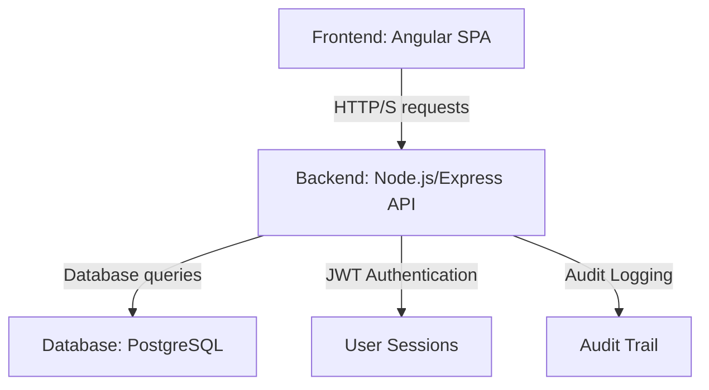
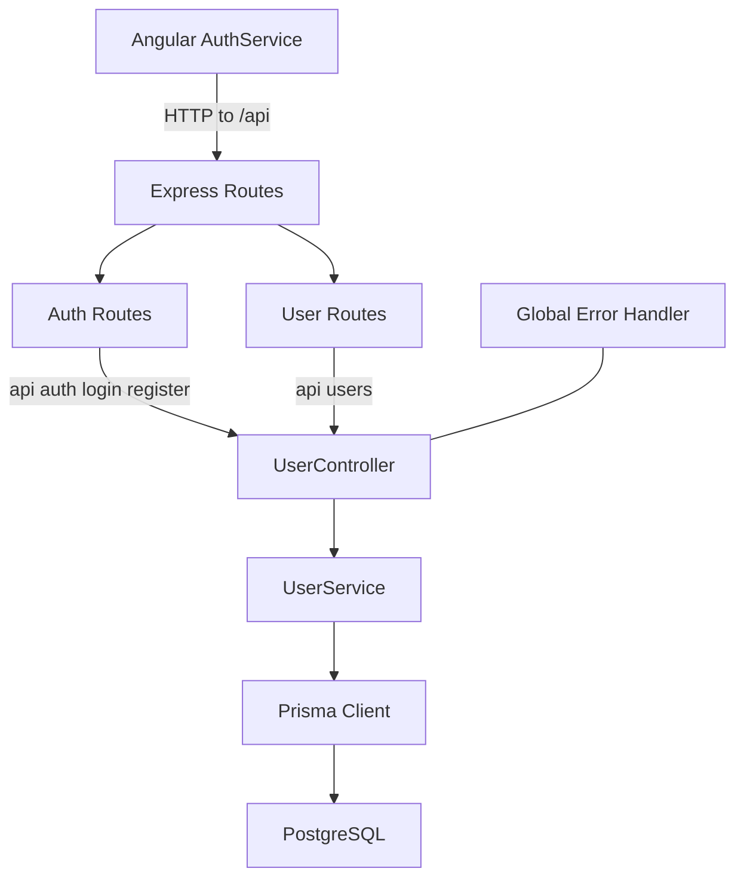

# System Architecture

The QUANT accounting system is designed as a classic client-server application, with a clear separation between the frontend (client) and the backend (server).

## High-Level Overview



### Frontend

The frontend is a single-page application (SPA) built with Angular. Its main responsibilities are:

*   **User Interface:** Rendering the application's UI and providing a responsive and interactive user experience.
*   **User Input:** Capturing user input through forms and other UI elements.
*   **API Interaction:** Communicating with the backend API to fetch and submit data.
*   **Client-Side State Management:** Managing the application's state on the client side.

The frontend is organized by features (e.g., authentication, financial statements, etc.), with each feature having its own set of components, services, and routes.

### Backend

The backend is a Node.js application built with Express.js. Its main responsibilities are:

*   **API:** Exposing a RESTful API for the frontend to consume.
*   **Business Logic:** Implementing the core business logic of the application.
*   **Database Interaction:** Interacting with the PostgreSQL database through the Prisma ORM.
*   **Authentication and Authorization:** Handling user authentication and authorization using JWT tokens.
*   **Security Features:** Implementing account lockout, password policies, and audit logging.

The backend is structured in layers, with a clear separation of concerns between routes, controllers, services, and data access.

### Database

The database is a PostgreSQL instance, and it serves as the single source of truth for the application's data. Prisma is used as the ORM to interact with the database in a type-safe manner.

## Backend Architecture

### Module Structure

The backend follows a modular architecture with clear separation of concerns:

```
backend/src/modules/user/
├── user.controller.ts      # HTTP request handling and validation
├── user.service.ts         # Business logic and data operations
├── user.routes.ts          # Route definitions
├── user.types.ts           # TypeScript interfaces and types
├── user.validation.ts      # Input validation schemas
└── README.md               # Module documentation
```

### Authentication Flow

1. **Login**: User provides credentials → Validate → Generate JWT → Create session → Return token
2. **Session Management**: JWT tokens stored in UserSession table with expiration tracking
3. **Security**: Account lockout after 5 failed attempts, 15-minute lock duration
4. **Audit Logging**: Comprehensive logging of all authentication attempts and user actions

### Key Components

* **UserService**: Core business logic for user management, authentication, and session handling
* **UserController**: HTTP request handling with proper validation and error responses
* **JWT Utility**: Secure token generation with minimal payload and strong secret requirements
* **Password Utility**: Password hashing and strength validation
* **Error Handling**: Centralized error management with audit logging

### Route Map

- /api/auth/login → [`UserController.login`](backend/src/modules/user/user.controller.ts)
  - Registered in [`auth.routes.ts`](backend/src/modules/auth/auth.routes.ts:8)
- /api/auth/register → [`UserController.register`](backend/src/modules/user/user.controller.ts)
  - Registered in [`auth.routes.ts`](backend/src/modules/auth/auth.routes.ts:9)
- /api/users → User management endpoints
  - Mounted in [`server.ts`](backend/src/server.ts:28), defined in [`user.routes.ts`](backend/src/modules/user/user.routes.ts)
- /api/currencies → Currency CRUD endpoints (GET/POST/PUT/DELETE)
  - Mounted in [`server.ts`](backend/src/server.ts:30), defined in [`currency.routes.ts`](backend/src/modules/currency/currency.routes.ts)

### Domain Models Highlight

- Enums:
  - [`AuditAction`](backend/prisma/schema.prisma:28)
  - [`AccountType`](backend/prisma/schema.prisma:41)
- Auth and Auditing:
  - [`UserAccount`](backend/prisma/schema.prisma:54)
  - [`UserSession`](backend/prisma/schema.prisma:112)
  - [`UserAuditLog`](backend/prisma/schema.prisma:153)
  - [`RolePermission`](backend/prisma/schema.prisma:133)
- Accounting Domain:
  - [`Currency`](backend/prisma/schema.prisma:178)
  - [`Client`](backend/prisma/schema.prisma:208)
  - [`Account`](backend/prisma/schema.prisma:246)

### Module Interaction Diagram



## Database Schema

The database schema is designed with a comprehensive user authentication and management system:

### Core Models

1. **UserAccount**: Main user entity with authentication, profile, and security features
2. **UserSession**: Manages user sessions with expiration and activity tracking
3. **RolePermission**: Implements role-based access control (RBAC)
4. **UserAuditLog**: Comprehensive audit logging for all user actions

### Key Features

*   **Hybrid Avatar System**: Supports generated, uploaded, social, and gravatar avatars
*   **Security Features**: Failed login tracking, account lockout, password change requirements
*   **Self-Referencing Relationships**: Tracks who created and updated each user account
*   **Optimized Indexes**: Performance-focused indexes for all query patterns
*   **Credential Uniqueness**: Enforced uniqueness for usernames and emails with validation

## Source Code Paths

*   **Backend Schema**: `backend/prisma/schema.prisma`
*   **Database Migrations**: `backend/prisma/migrations/`
*   **Backend Server**: `backend/src/server.ts`
*   **User Module**: `backend/src/modules/user/`
*   **Currency Module**: `backend/src/modules/currency/`
*   **JWT Utility**: `backend/src/utils/jwt.ts`
*   **Password Utility**: `backend/src/utils/password.ts`
*   **Error Handling**: `backend/src/utils/error.ts`
*   **Frontend App**: `frontend/src/app/`

## Design Patterns

*   **MVC Pattern**: Separation of concerns with Models, Views, and Controllers
*   **Repository Pattern**: Data access abstraction through Prisma
*   **JWT Authentication**: Token-based authentication for API security with session persistence
*   **Role-Based Access Control**: Permission system based on user roles
*   **Service Layer Pattern**: Business logic separation from controllers
*   **Audit Pattern**: Comprehensive logging of all user actions and system events