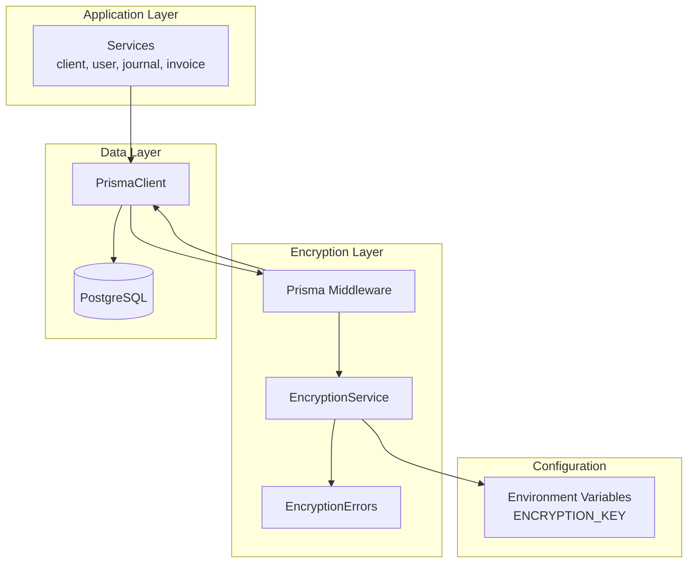
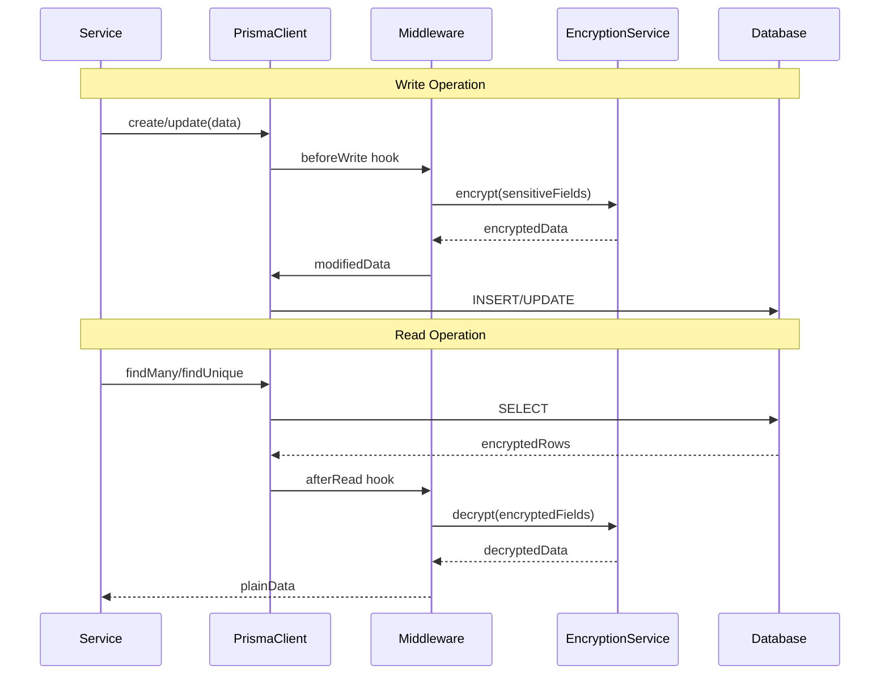
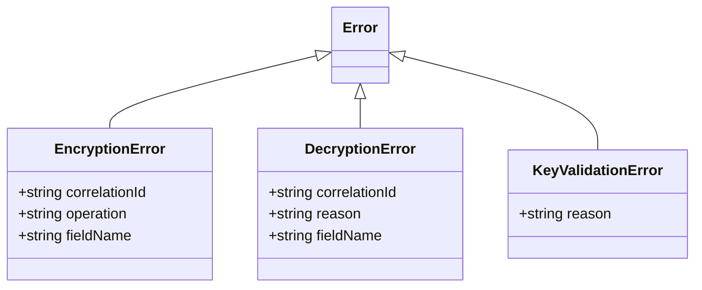

# Design Document: AES-256-GCM Encryption Service

## Overview

Este documento describe el diseño técnico para implementar un sistema de encriptación AES-256-GCM en el backend de QUANT. El sistema proporciona cifrado autenticado para datos sensibles siguiendo los estándares ISO/IEC 18033-3 e ISO/IEC 19772.

El servicio de encriptación se integra transparentemente con Prisma mediante middleware, encriptando automáticamente campos sensibles antes de escribir a la base de datos y desencriptándolos al leer.

## Architecture



### Data Flow



## Components and Interfaces

### 1. EncryptionService (`backend/src/utils/encryption.service.ts`)

Servicio centralizado que encapsula toda la lógica criptográfica.

```typescript
interface EncryptionService {
  // Core encryption/decryption
  encrypt(plaintext: string): string;
  decrypt(ciphertext: string): string;
  
  // Key management
  validateKey(key: string): void;
  deriveKey(password: string, salt: Buffer): Buffer;
  
  // Key rotation
  rotateKey(oldKey: string, newKey: string, data: string): string;
  
  // Utilities
  generateSalt(): Buffer;
  isEncrypted(value: string): boolean;
}
```

### 2. Encryption Errors (`backend/src/utils/encryption.errors.ts`)

Excepciones específicas para operaciones criptográficas.

```typescript
class EncryptionError extends Error {
  correlationId: string;
  operation: string;
}

class DecryptionError extends Error {
  correlationId: string;
  reason: 'FORMAT_INVALID' | 'AUTH_TAG_MISMATCH' | 'KEY_INVALID';
}

class KeyValidationError extends Error {
  reason: 'MISSING' | 'INVALID_LENGTH' | 'INVALID_FORMAT';
}
```

### 3. Prisma Encryption Middleware (`backend/src/middleware/encryption.middleware.ts`)

Middleware que intercepta operaciones de Prisma para encriptar/desencriptar automáticamente.

```typescript
interface EncryptedFieldConfig {
  model: string;
  fields: string[];
}

function createEncryptionMiddleware(
  config: EncryptedFieldConfig[]
): Prisma.Middleware;
```

### 4. Encryption Configuration (`backend/src/config/encryption.config.ts`)

Configuración centralizada de campos encriptables por modelo.

```typescript
const ENCRYPTED_FIELDS: EncryptedFieldConfig[] = [
  { model: 'Client', fields: ['email', 'phone', 'address', 'creditLimit'] },
  { model: 'UserAccount', fields: ['email', 'phone', 'recoveryEmail'] },
  { model: 'JournalEntry', fields: ['description', 'notes'] },
  { model: 'Invoice', fields: ['clientEmail', 'billingAddress', 'notes'] }
];
```

## Data Models

### Encrypted Data Format

Los datos encriptados se almacenan en formato base64 con la siguiente estructura interna:

```
base64(IV || AuthTag || Ciphertext)

Where:
- IV: 12 bytes (96 bits) - Initialization Vector
- AuthTag: 16 bytes (128 bits) - GCM Authentication Tag
- Ciphertext: Variable length - Encrypted data
```

### Storage Considerations

| Model | Field | Original Type | Storage Impact |
|-------|-------|---------------|----------------|
| Client | email | VARCHAR(255) | ~340 chars max |
| Client | phone | VARCHAR(50) | ~100 chars max |
| Client | address | TEXT | Variable |
| Client | creditLimit | DECIMAL | ~60 chars |
| UserAccount | email | VARCHAR(255) | ~340 chars max |
| UserAccount | phone | VARCHAR(50) | ~100 chars max |
| UserAccount | recoveryEmail | VARCHAR(255) | ~340 chars max |
| JournalEntry | description | TEXT | Variable |
| JournalEntry | notes | TEXT | Variable |
| Invoice | clientEmail | VARCHAR(255) | ~340 chars max |
| Invoice | billingAddress | TEXT | Variable |
| Invoice | notes | TEXT | Variable |

**Nota**: El overhead de encriptación es aproximadamente 37 bytes (12 IV + 16 AuthTag + base64 encoding ~33% overhead).

## Correctness Properties

*A property is a characteristic or behavior that should hold true across all valid executions of a system-essentially, a formal statement about what the system should do. Properties serve as the bridge between human-readable specifications and machine-verifiable correctness guarantees.*

### Property 1: Key Validation Correctness
*For any* string input as encryption key, the Encryption_Service SHALL accept it if and only if it contains exactly 64 hexadecimal characters (0-9, a-f, A-F), and SHALL throw KeyValidationError for all other inputs.
**Validates: Requirements 1.1, 1.2**

### Property 2: Non-Deterministic Encryption
*For any* plaintext string, encrypting it twice with the same key SHALL produce two different ciphertext outputs.
**Validates: Requirements 1.6**

### Property 3: Output Format Compliance
*For any* encrypted output, decoding from base64 SHALL yield exactly 28+ bytes where the first 12 bytes are IV, next 16 bytes are AuthTag, and remaining bytes are ciphertext.
**Validates: Requirements 1.5**

### Property 4: Encryption/Decryption Round-Trip
*For any* plaintext string, encrypting then decrypting with the same key SHALL return the exact original plaintext.
**Validates: Requirements 3.1, 3.2**

### Property 5: Error Message Safety
*For any* encryption or decryption error, the error message SHALL NOT contain the plaintext data, and SHALL contain a correlation ID.
**Validates: Requirements 4.1, 4.4, 4.5**

### Property 6: Corruption Detection
*For any* ciphertext with corrupted format (invalid base64, wrong component lengths), decryption SHALL throw DecryptionError with reason 'FORMAT_INVALID'.
**Validates: Requirements 4.2**

### Property 7: Tampering Detection
*For any* valid ciphertext with modified authentication tag, decryption SHALL throw DecryptionError with reason 'AUTH_TAG_MISMATCH'.
**Validates: Requirements 4.3**

### Property 8: Key Rotation Round-Trip
*For any* data encrypted with oldKey, after rotation to newKey, the data SHALL be decryptable with newKey and return original plaintext.
**Validates: Requirements 5.2**

### Property 9: Key Rotation Resilience
*For any* batch of records during key rotation, if some records fail, the rotation SHALL continue processing remaining records and return accurate success/failure counts.
**Validates: Requirements 5.3, 5.4**

## Error Handling

### Error Hierarchy



### Error Handling Strategy

1. **Key Validation Errors**: Thrown at server startup, preventing the application from running with invalid configuration.

2. **Encryption Errors**: Logged with correlation ID, original operation fails with safe error message to client.

3. **Decryption Errors**: 
   - Format errors indicate data corruption
   - Auth tag errors indicate tampering
   - Both logged for security audit

### Audit Logging

```typescript
interface CryptoAuditLog {
  timestamp: Date;
  operation: 'encrypt' | 'decrypt' | 'key_rotation';
  model: string;
  fieldName: string;
  success: boolean;
  correlationId?: string;
  errorType?: string;
  // Never log: plaintext, ciphertext, keys
}
```

## Testing Strategy

### Dual Testing Approach

El sistema utiliza tanto tests unitarios como tests basados en propiedades (PBT) para garantizar la corrección:

- **Unit Tests**: Verifican ejemplos específicos, casos edge y condiciones de error
- **Property-Based Tests**: Verifican propiedades universales que deben cumplirse para todas las entradas

### Property-Based Testing Framework

**Framework**: [fast-check](https://github.com/dubzzz/fast-check) - Biblioteca de PBT para TypeScript/JavaScript

**Configuración**: Mínimo 100 iteraciones por propiedad para garantizar cobertura estadística significativa.

### Test Categories

#### 1. Unit Tests (`encryption.service.test.ts`)

- Key validation with specific invalid inputs
- Encryption/decryption with known test vectors
- Error handling for specific edge cases
- Middleware integration with mock Prisma

#### 2. Property-Based Tests (`encryption.property.test.ts`)

Cada test debe estar anotado con el formato:
```typescript
// **Feature: aes-encryption, Property {number}: {property_text}**
```

**Properties to test:**
- Property 1: Key validation correctness
- Property 2: Non-deterministic encryption
- Property 3: Output format compliance
- Property 4: Round-trip consistency
- Property 5: Error message safety
- Property 6: Corruption detection
- Property 7: Tampering detection
- Property 8: Key rotation round-trip
- Property 9: Key rotation resilience

### Test Data Generators

```typescript
// Arbitrary for valid plaintext
const arbPlaintext = fc.string({ minLength: 0, maxLength: 10000 });

// Arbitrary for valid hex key (64 chars)
const arbValidKey = fc.hexaString({ minLength: 64, maxLength: 64 });

// Arbitrary for invalid keys
const arbInvalidKey = fc.oneof(
  fc.string({ maxLength: 63 }),  // Too short
  fc.string({ minLength: 65 }),  // Too long
  fc.constant(''),               // Empty
  fc.string().filter(s => !/^[0-9a-fA-F]*$/.test(s)) // Non-hex
);
```
