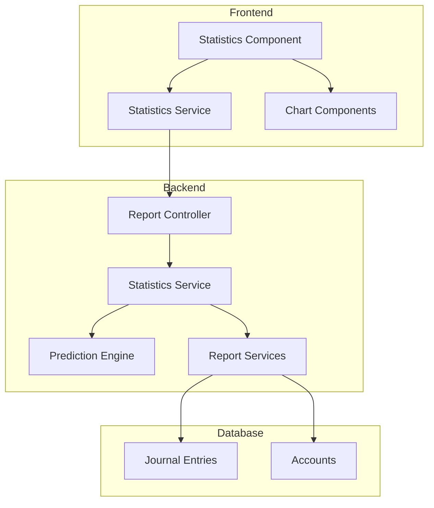

# Design Document: Statistics Module

## Overview

El módulo de estadísticas es un componente integral del sistema QUANT que proporciona visualización de KPIs financieros, reportes consolidados y predicciones basadas en IA. Se implementará como un componente Angular standalone que consume endpoints del backend para obtener datos agregados y proyecciones.

### Key Features
- Panel de filtros con selector de rango de fechas
- Tarjetas KPI para métricas financieras clave
- Secciones de Balance General, Estado de Resultados y Balanza de Comprobación
- Panel de predicciones con proyecciones a 3, 6 y 12 meses
- Gráficos interactivos (barras, circular, área, líneas)

## Architecture



### Design Patterns
- **Facade Pattern**: El Statistics Service del backend actúa como fachada para los servicios de reportes existentes
- **Strategy Pattern**: El Prediction Engine usa diferentes estrategias de predicción (regresión lineal, promedios móviles)
- **Observer Pattern**: Los componentes Angular usan signals para reactividad

## Components and Interfaces

### Frontend Components

#### StatisticsComponent
```typescript
@Component({
  selector: 'app-statistics',
  standalone: true,
  imports: [CommonModule, FormsModule, SidebarComponent, ...ChartComponents]
})
export class StatisticsComponent {
  // State signals
  state: Signal<'idle' | 'loading' | 'success' | 'error'>;
  
  // Data signals
  kpis: Signal<StatisticsKPIs | null>;
  balanceSheet: Signal<BalanceSheetSummary | null>;
  incomeStatement: Signal<IncomeStatementSummary | null>;
  trialBalance: Signal<TrialBalanceSummary | null>;
  predictions: Signal<PredictionData | null>;
  chartData: Signal<ChartDataSets | null>;
  
  // Filter state
  filters: StatisticsFilters;
  
  // Methods
  generateStatistics(): void;
  resetFilters(): void;
}
```

#### Chart Components
- `IncomeExpenseBarChartComponent`: Gráfico de barras comparativo mensual
- `ExpenseDistributionPieChartComponent`: Gráfico circular de distribución de gastos
- `EquityEvolutionAreaChartComponent`: Gráfico de área para evolución del patrimonio
- `PredictionLineChartComponent`: Gráfico de líneas para predicciones vs histórico

### Backend Services

#### StatisticsService
```typescript
class StatisticsService {
  async getStatistics(query: IStatisticsQuery): Promise<IStatisticsResponse>;
  async getPredictions(query: IPredictionQuery): Promise<IPredictionResponse>;
  private aggregateKPIs(startDate: string, endDate: string): Promise<IStatisticsKPIs>;
  private getChartData(startDate: string, endDate: string): Promise<IChartDataSets>;
}
```

#### PredictionEngine
```typescript
class PredictionEngine {
  calculateLinearRegression(data: number[]): LinearRegressionResult;
  calculateMovingAverage(data: number[], window: number): number[];
  projectValues(historical: MonthlyData[], months: number): ProjectedValue[];
  calculateConfidence(data: number[]): number;
}
```

### API Endpoints

| Method | Endpoint | Description |
|--------|----------|-------------|
| GET | `/api/reports/statistics` | Get aggregated statistics for date range |
| GET | `/api/reports/predictions` | Get AI predictions for future periods |

## Data Models

### Frontend Types

```typescript
interface StatisticsFilters {
  startDate: string;
  endDate: string;
}

interface StatisticsKPIs {
  totalAssets: number;
  totalLiabilities: number;
  netEquity: number;
  periodRevenue: number;
  periodExpenses: number;
  netProfitLoss: number;
  isProfit: boolean;
}

interface PredictionData {
  revenue: ProjectionSet;
  costs: ProjectionSet;
  expenses: ProjectionSet;
  hasInsufficientData: boolean;
  insufficientDataMessage?: string;
}

interface ProjectionSet {
  historical: MonthlyDataPoint[];
  projections: {
    threeMonths: ProjectedValue[];
    sixMonths: ProjectedValue[];
    twelveMonths: ProjectedValue[];
  };
  confidence: number; // 0-100
}

interface ProjectedValue {
  month: string;
  value: number;
  lowerBound: number;
  upperBound: number;
}

interface MonthlyDataPoint {
  month: string;
  value: number;
}

interface ChartDataSets {
  incomeVsExpense: IncomeExpenseData[];
  expenseDistribution: CategoryDistribution[];
  equityEvolution: EquityDataPoint[];
}
```

### Backend Types

```typescript
interface IStatisticsQuery {
  startDate: string;  // ISO date YYYY-MM-DD
  endDate: string;    // ISO date YYYY-MM-DD
}

interface IStatisticsResponse {
  success: boolean;
  data: {
    kpis: IStatisticsKPIs;
    balanceSheet: IBalanceSheetSummary;
    incomeStatement: IIncomeStatementSummary;
    trialBalance: ITrialBalanceSummary;
    charts: IChartDataSets;
    generatedAt: string;
  };
  error?: { code: string; message: string; };
}

interface IPredictionQuery {
  baseDate: string;   // Date to project from
  months: number;     // Months of historical data to analyze
}

interface IPredictionResponse {
  success: boolean;
  data: {
    revenue: IProjectionSet;
    costs: IProjectionSet;
    expenses: IProjectionSet;
    hasInsufficientData: boolean;
    insufficientDataMessage?: string;
    generatedAt: string;
  };
  error?: { code: string; message: string; };
}
```

## Correctness Properties

*A property is a characteristic or behavior that should hold true across all valid executions of a system-essentially, a formal statement about what the system should do. Properties serve as the bridge between human-readable specifications and machine-verifiable correctness guarantees.*

Based on the prework analysis, the following correctness properties have been identified:

### Property 1: Account Balance Aggregation
*For any* set of account balances, the KPI totals (assets, liabilities, revenue, expenses) SHALL equal the sum of their respective account type balances.
**Validates: Requirements 2.1, 2.2, 2.4, 2.5**

### Property 2: Net Equity Calculation
*For any* total assets value A and total liabilities value L, the net equity SHALL equal A - L.
**Validates: Requirements 2.3**

### Property 3: Net Profit/Loss Calculation
*For any* revenue value R and expenses value E, the net profit/loss SHALL equal R - E.
**Validates: Requirements 2.6**

### Property 4: Gross Profit Calculation
*For any* revenue value R and costs value C, the gross profit SHALL equal R - C.
**Validates: Requirements 4.2**

### Property 5: Net Income Calculation
*For any* gross profit value GP and operating expenses value OE, the net income SHALL equal GP - OE.
**Validates: Requirements 4.3**

### Property 6: Accounting Equation Verification
*For any* balance sheet with assets A, liabilities L, and equity E, the isBalanced flag SHALL be true if and only if A equals L + E (within rounding tolerance of 0.01).
**Validates: Requirements 3.3**

### Property 7: Trial Balance Verification
*For any* trial balance with total debits D and total credits C, the isBalanced flag SHALL be true if and only if D equals C (within rounding tolerance of 0.01).
**Validates: Requirements 5.3**

### Property 8: Date Range Validation
*For any* date range where startDate > endDate, the system SHALL reject the request and return a validation error.
**Validates: Requirements 1.3**

### Property 9: Insufficient Data Detection
*For any* historical data set with fewer than 3 months of data, the prediction engine SHALL return hasInsufficientData = true.
**Validates: Requirements 6.5**

### Property 10: Confidence Indicator Bounds
*For any* prediction calculation, the confidence indicator SHALL be a value between 0 and 100 inclusive.
**Validates: Requirements 6.3**

### Property 11: Expense Distribution Sum
*For any* expense distribution pie chart data, the sum of all category percentages SHALL equal 100 (within rounding tolerance of 0.1).
**Validates: Requirements 7.2**

### Property 12: Statistics JSON Round-Trip
*For any* valid statistics response object, serializing to JSON and deserializing back SHALL produce an equivalent object.
**Validates: Requirements 9.3, 9.4**

### Property 13: Linear Regression Projection Monotonicity
*For any* strictly increasing historical data series, the linear regression projection SHALL produce non-decreasing projected values.
**Validates: Requirements 6.1**

### Property 14: Subtotal Consistency
*For any* hierarchical account structure, the parent account subtotal SHALL equal the sum of its child account balances.
**Validates: Requirements 3.2, 5.2**

## Error Handling

### Frontend Error States
- **Loading Error**: Display error card with message and retry button
- **Validation Error**: Inline error messages on filter inputs
- **Empty Data**: Display placeholder with helpful message

### Backend Error Handling
- **Invalid Date Range**: Return 400 with validation error
- **Database Error**: Return 500 with generic error message, log details
- **Insufficient Data**: Return success with hasInsufficientData flag

### Error Response Format
```typescript
{
  success: false,
  error: {
    code: 'VALIDATION_ERROR' | 'DATABASE_ERROR' | 'INTERNAL_ERROR',
    message: string
  }
}
```

## Testing Strategy

### Dual Testing Approach

This module requires both unit tests and property-based tests for comprehensive coverage.

#### Unit Tests
- Component rendering tests for each state (idle, loading, success, error, empty)
- Service method tests with mocked HTTP responses
- Chart component rendering with sample data
- Filter validation edge cases

#### Property-Based Testing

**Library**: fast-check (npm package for TypeScript/JavaScript property-based testing)

**Configuration**: Each property test will run a minimum of 100 iterations.

**Property Test Implementation**:

1. **Account Aggregation Property** (Property 1)
   - Generate random arrays of account balances
   - Verify sum calculation matches expected total

2. **Derived Calculations Properties** (Properties 2-5)
   - Generate random numeric inputs
   - Verify arithmetic operations produce correct results

3. **Balance Verification Properties** (Properties 6-7)
   - Generate random balance sheet/trial balance data
   - Verify isBalanced flag correctly reflects equality

4. **Date Validation Property** (Property 8)
   - Generate random date pairs where start > end
   - Verify system rejects all invalid ranges

5. **Insufficient Data Property** (Property 9)
   - Generate data sets with 0, 1, 2 months of data
   - Verify hasInsufficientData is always true

6. **Confidence Bounds Property** (Property 10)
   - Generate random historical data sets
   - Verify confidence is always in [0, 100]

7. **Distribution Sum Property** (Property 11)
   - Generate random expense categories with amounts
   - Verify percentages sum to 100

8. **JSON Round-Trip Property** (Property 12)
   - Generate random valid statistics objects
   - Verify JSON.parse(JSON.stringify(obj)) equals obj

9. **Regression Monotonicity Property** (Property 13)
   - Generate strictly increasing number sequences
   - Verify projections are non-decreasing

10. **Subtotal Consistency Property** (Property 14)
    - Generate hierarchical account structures
    - Verify parent totals equal sum of children

**Test File Naming Convention**: `*.property.test.ts`

**Test Annotation Format**:
```typescript
// **Feature: statistics-module, Property 1: Account Balance Aggregation**
// **Validates: Requirements 2.1, 2.2, 2.4, 2.5**
```
